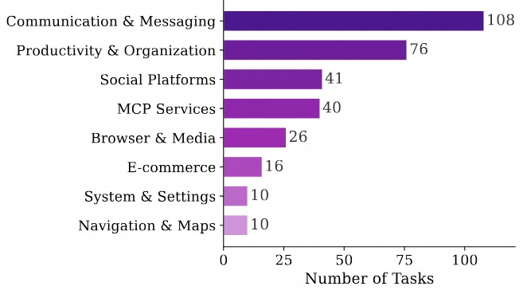

<h1 align="center">Mobile World</h1>

<p align="center">
  <strong>Benchmarking Autonomous Mobile Agents in Agent-User Interactive, and MCP-Augmented Environments</strong>
</p>

<p align="center">
  <a href="https://tongyi-mai.github.io/MobileWorld/">Website</a> •
  <a href="https://arxiv.org/abs/2512.19432">Paper</a> •
  <a href="https://github.com/Tongyi-MAI/MobileWorld/tree/main/docs">Docs</a> •
  <a href="https://github.com/Tongyi-MAI/MobileWorld/issues">Issues</a>
</p>

<p align="center">
    <a href="https://img.shields.io/badge/PRs-Welcome-red">
        
    </a>
    <a href="https://img.shields.io/github/last-commit/Tongyi-MAI/MobileWorld?color=green">
        
    </a>
    <a href="https://opensource.org/licenses/Apache-2.0">
        
    </a>
    <a href="https://img.shields.io/badge/Python-3.12+-blue.svg">
        
    </a>

</p>

**Mobile World** is a challenging mobile-use benchmark designed to reflect real-world scenarios. It comprises **201 tasks** across **20 applications**, featuring long-horizon, cross-app tasks, and novel task categories including agent–user interaction and MCP-augmented tasks.

- 🎯 **201 Diverse Tasks**: Comprehensive benchmark spanning 20 real-world mobile applications
- 🔄 **Long-Horizon Tasks**: Multi-step reasoning and cross-app workflows
- 👥 **Agent-User Interaction**: Novel tasks requiring dynamic human-agent collaboration
- 🔧 **MCP-Augmented Tasks**: Leverage Model Context Protocol for external tool integration

<p align="center">
  
</p>

## 📢 Updates
- **2026-12-29**: We released [MAI-UI](https://tongyi-mai.github.io/MAI-UI/), achieving state-of-the-art performance with a 41.7% success rate in the end-to-end models category on the Mobile World benchmark.
- **2025-12-23**: Docker image `ghcr.io/Tongyi-MAI/mobile_world:latest` available for public use!
- **2025-12-23**: Initial release of Mobile World benchmark. Check out our [paper](https://arxiv.org/abs/2512.19432) and [website](https://tongyi-mai.github.io/MobileWorld/)!


## 📋 Table of Contents
- [Updates](#-updates)
- [Overview](#-overview)
- [Installation](#-installation)
- [Quick Start](#-quick-start)
- [Available Commands](#-available-commands)
- [Documentation](#-documentation)
- [Benchmark Statistics](#-benchmark-statistics)
- [Contributors](#-open-source-contributors)
- [Acknowledgements](#-acknowledgements)
- [Citation](#-citation)
- [Contact](#-contact)

---


---

## 📖 Overview

<p align="center">
  
</p>

Mobile World is a comprehensive benchmark for evaluating autonomous mobile agents in realistic scenarios. Our benchmark features a robust infrastructure and deterministic evaluation methodology:

### 🏗️ System Architecture

**Containerized Environment**  
The entire evaluation environment runs in Docker-in-Docker containers, including:
- Rooted Android Virtual Device (AVD)
- Self-hosted application backends
- API server for orchestration

This design eliminates external dependencies and enables consistent deployment across different host systems.

**Open-Source Applications**  
We build stable, reproducible environments using popular open-source projects:
- **Mattermost**: Enterprise communication (Slack alternative)
- **Mastodon**: Social media platform (X/Twitter alternative)  
- **Mall4Uni**: E-commerce platform

Self-hosting provides full backend access, enabling precise control over task initialization and deterministic verification.

**Snapshot-Based State Management**  
AVD snapshots capture complete device states, ensuring each task execution begins from identical initial conditions for reproducible results.

### ✅ Task Evaluation

We implement multiple complementary verification methods for reliable assessment:

- **Textual Answer Verification**: Pattern matching and string comparison for information retrieval tasks
- **Backend Database Verification**: Direct database queries to validate state changes (messages, posts, etc.)
- **Local Storage Inspection**: ADB-based inspection of application data (calendar events, email drafts, etc.)
- **Application Callbacks**: Custom APIs capturing intermediate states for validation

## 💾 Installation

### System Requirements

- **Docker** with privileged container support
- **KVM** (Kernel-based Virtual Machine) for Android emulator acceleration
- **Python 3.12+**
- **Linux** host system (or Windows with WSL2 + KVM enabled), MacOS support is in progress.

### Quick Install

```bash
# Clone the repository
git clone https://github.com/Tongyi-MAI/MobileWorld.git
cd MobileWorld

# Install dependencies with uv
uv sync
```

### Environment Configuration

Create a `.env` file from `.env.example` in the project root:

```bash
cp .env.example .env
```

Edit the `.env` file and configure the following parameters:

**Required for Agent Evaluation:**
- `API_KEY`: Your OpenAI-compatible API key for the agent model
- `USER_AGENT_API_KEY`: API key for user agent LLM (used in agent-user interactive tasks)
- `USER_AGENT_BASE_URL`: Base URL for user agent API endpoint
- `USER_AGENT_MODEL`: Model name for user agent (e.g., `gpt-4.1`)

**Required for MCP-Augmented Tasks:**
- `DASHSCOPE_API_KEY`: DashScope API key for MCP services
- `MODELSCOPE_API_KEY`: ModelScope API key for MCP services

**Example `.env` file:**
```bash
API_KEY=your_api_key_for_agent_model
DASHSCOPE_API_KEY=dashscope_api_key_for_mcp
MODELSCOPE_API_KEY=modelscope_api_key_for_mcp

USER_AGENT_API_KEY=your_user_agent_llm_api_key
USER_AGENT_BASE_URL=your_user_agent_base_url
USER_AGENT_MODEL=gpt-4.1
```

> **Note**: 
> - MCP API keys are only required if you plan to run MCP-augmented tasks
> - User agent settings are only required for agent-user interactive tasks
> - See [MCP Setup Guide](docs/mcp_setup.md) for detailed MCP server configuration

---

## 🚀 Quick Start

### 1. Check Environment & Pull Docker Image

```bash
sudo uv run mw env check
```

This command verifies Docker, KVM support, and prompts to pull the latest `mobile_world` Docker image if needed.

### 2. Launch Docker Containers

```bash
sudo uv run mw env run --count 5 --launch-interval 20
```

This launches 5 containerized Android environments with:
- `--count 5`: Number of parallel containers
- `--launch-interval 20`: Wait 20 seconds between container launches

### 3. Run Evaluation

```bash
sudo uv run mw eval \
    --agent_type qwen3vl \
    --task ALL \
    --max_round 50 \
    --model_name Qwen3-VL-235B-A22B \
    --llm_base_url [openai_compatible_url] \
    --step_wait_time 3 \
    --log_file_root traj_logs/qwen3_vl_logs \
    --enable_mcp
```

### 4. View Results

```bash
uv run mw logs view --log_dir traj_logs/qwen3_vl_logs
```

Opens an interactive web-based visualization at `http://localhost:8760` to explore task trajectories and results.

---

## 🔧 Available Commands

Mobile World provides a comprehensive CLI (`mw` or `mobile-world`) with the following commands:

| Command | Description |
|---------|-------------|
| `mw env check` | Check prerequisites (Docker, KVM) and pull latest image |
| `mw env run` | Launch Docker container(s) with Android emulators |
| `mw env list` | List running Mobile World containers |
| `mw env rm` | Remove/destroy containers |
| `mw env info` | Get detailed info about a container |
| `mw env restart` | Restart the server in a container |
| `mw env exec` | Open a shell in a container |
| `mw eval` | Run benchmark evaluation suite |
| `mw test` | Run a single ad-hoc task for testing |
| `mw info task` | Display available tasks |
| `mw info agent` | Display available agents |
| `mw info app` | Display available apps |
| `mw info mcp` | Display available MCP tools |
| `mw logs view` | Launch interactive log viewer |
| `mw logs results` | Print results summary table |
| `mw logs export` | Export logs as static HTML site |
| `mw device` | View live Android device screen |
| `mw server` | Start the backend API server |

Use `mw <command> --help` for detailed options.

---

## 📚 Documentation

For detailed documentation, see the `docs/` directory:

| Document | Description |
|----------|-------------|
| [Development Guide](docs/development.md) | Dev mode, debugging, container management workflows |
| [MCP Setup](docs/mcp_setup.md) | Configure MCP servers for external tool integration |
| [Windows Setup](docs/setup_for_windows.md) | WSL2 and KVM setup instructions for Windows |
| [AVD Configuration](docs/configure_avd.md) | Customize and save Android Virtual Device snapshots |

---

## 🎯 Benchmark Statistics

<table align="center">
  <tr>
    <td></td>
    <td></td>
  </tr>
</table>

Mobile World comprises **201 tasks** spanning diverse complexity levels and evaluation methodologies:

### Task Categories

- **GUI-Only Tasks** (116, 57.7%): Standard mobile operations through graphical interface
- **Agent-User Interactive Tasks** (45, 22.4%): Tasks requiring dynamic human-agent collaboration
- **MCP-Augmented Tasks** (40, 19.9%): Tasks leveraging external tools via Model Context Protocol

### Application Complexity

- **Single-App Tasks** (76, 37.8%): Operations within one application
- **Two-App Tasks** (100, 49.8%): Cross-application workflows involving two apps
- **Multi-App Tasks** (25, 12.4%): Complex tasks spanning three or more applications

### Evaluation Methods

Our deterministic evaluation employs four complementary verification approaches:
- **Database Verification** (95, 47.3%): Backend database state validation
- **Storage Inspection** (74, 36.8%): Local storage and file system checks
- **Textual Matching** (22, 10.9%): Pattern-based answer verification
- **App Callbacks** (10, 5.0%): Custom API-based state capture

### MCP Infrastructure

- **5 MCP Servers** for external tool integration
- **64 MCP Tools** enabling extended agent capabilities

---

## 👥 Open Source Contributors

Thanks to all the contributors!

<a href="https://github.com/Tongyi-MAI/MobileWorld/graphs/contributors">
  
</a>

---


## 📬 Contact

For questions, issues, or collaboration inquiries:

- **GitHub Issues**: [Open an issue](https://github.com/Tongyi-MAI/MobileWorld/issues)
- **Email**: Contact the maintainers
- **WeChat Group**: Scan to join our discussion group

<p align="center">
  
</p>

---

## 🙏 Acknowledgements

We thank [Android World](https://github.com/google-research/android_world) and [Android-Lab](https://github.com/THUDM/Android-Lab) for their open source contributions.

---

## 📄 Citation

If you find Mobile World useful in your research, please cite our paper:

```bibtex
@misc{kong2025mobileworldbenchmarkingautonomousmobile,
      title={MobileWorld: Benchmarking Autonomous Mobile Agents in Agent-User Interactive, and MCP-Augmented Environments}, 
      author={Quyu Kong and Xu Zhang and Zhenyu Yang and Nolan Gao and Chen Liu and Panrong Tong and Chenglin Cai and Hanzhang Zhou and Jianan Zhang and Liangyu Chen and Zhidan Liu and Steven Hoi and Yue Wang},
      year={2025},
      eprint={2512.19432},
      archivePrefix={arXiv},
      primaryClass={cs.AI},
      url={https://arxiv.org/abs/2512.19432}, 
}
```

---

## ⭐ Star History

If you find Mobile World helpful, please consider giving us a star ⭐!

[](https://star-history.com/#Tongyi-MAI/MobileWorld&Date)
